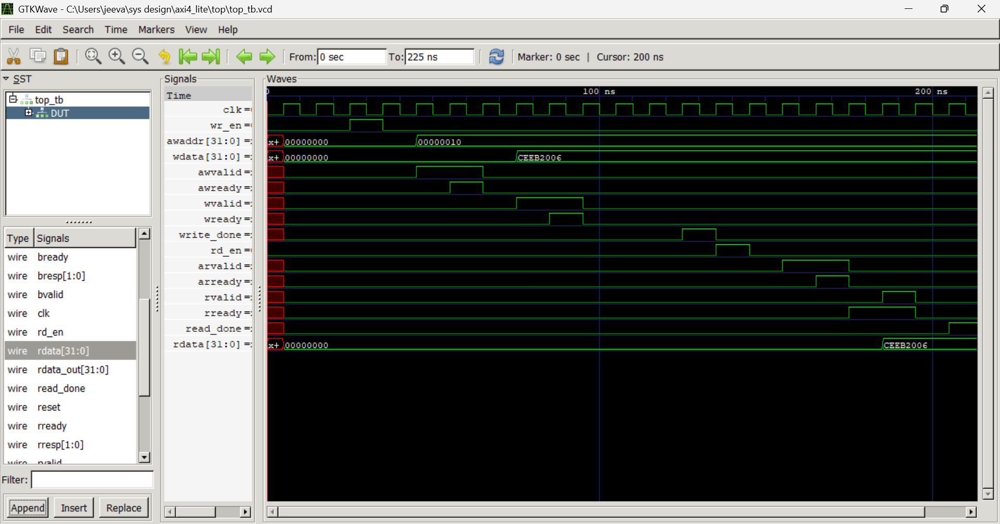

# AXI4-Lite Master-Slave Simulation in Verilog

This project implements a **fully functional AXI4-Lite** protocol system with:
- An AXI4-Lite **Master controller** (custom FSM-based)
- A simulated **Slave (peripheral) module** with memory-mapped registers
- A **Top-level interconnect** that wires them together
- A **Testbench** that performs a realistic write-read transaction
- **Waveform generation** for debugging and timing analysis

This simulation demonstrates the **core principles of AMBA AXI4-Lite protocol**, often used in SoC buses and IP integration for embedded/VLSI systems.

---

## 📐 Architecture Overview

    +----------------+          +-------------------+
    |                | AXI Bus  |                   |
    |   MASTER        <-------->       SLAVE        |
    |   (FSM-based)  |          |  (Register Memory)|
    +----------------+          +-------------------+
           ↑                              ↑
           |                              |
    +------+-------+              +-------+--------+
    |   top.v      |              |    axi4.v      |
    +--------------+              +----------------+

- **`master.v`**: Drives the AXI write & read transactions
- **`axi4.v`**: Simulated peripheral with 32 registers
- **`top.v`**: Connects AXI signals between master and slave
- **`top_tb.v`**: Simulates a write followed by a read

---

## 💡 Protocol Details (AXI4-Lite)

This design uses **independent address, data, and response channels**:
- **Write Channels**:
  - `AW` (write address)
  - `W`  (write data)
  - `B`  (write response)
- **Read Channels**:
  - `AR` (read address)
  - `R`  (read data + response)

Each channel uses:
- `VALID` from sender
- `READY` from receiver  
The transaction happens only when both `VALID` and `READY` are high in the same clock cycle.

---

## 🧠 What You’ll Learn

- Real-world AXI4-Lite FSM design (Master)
- Protocol handshaking logic
- Write/Read data sequencing
- Slave memory mapping using address decoding
- Simulating peripherals using testbench
- Waveform debugging using `$dumpfile` + GTKWave

---

## 🧪 How to Simulate

### 1. Run simulation:
```bash
iverilog -o top_tb top_tb.v
vvp top_tb
gtkwave top_tb.vcd
```
## You should see messages like:
```
✅ Write complete at 80
✅ Read complete at 150, rdata_out = 0xCEEB2006
```
## 🧪 Simulation Output

Below is the simulation waveform captured using GTKWave, showcasing a full AXI4-Lite write followed by a read transaction:



### 📌 Highlights:
- **Write transaction**: You can see the `awvalid`, `awready`, `wvalid`, `wready`, `bvalid`, `bready` signals toggling as per the AXI handshake protocol.
- **Read transaction**: `arvalid`, `arready`, `rvalid`, and `rready` successfully initiate and complete the read.
- The final read data (`rdata`) matches the previously written value, confirming proper memory-mapped behavior.

🧩 File Descriptions
| File       | Description                                     |
| ---------- | ----------------------------------------------- |
| `master.v` | FSM-based AXI4-Lite Master module               |
| `axi4.v`   | AXI4-Lite compliant Slave module (memory model) |
| `top.v`    | Connects Master and Slave (AXI signal wiring)   |
| `top_tb.v` | Testbench simulating full read/write cycle      |
| `docs/`    | Markdown docs explaining FSM logic and flow     |

📦 Features
✅ AXI4-Lite-compliant Master FSM
✅ Register-mapped Slave with read/write memory
✅ Proper use of VALID/READY handshake
✅ Address decoding using addr[6:2]
✅ Testbench-controlled simulation with $display
✅ GTKWave debug ready (.vcd waveform dump)

## 🙌 Personal Note

This project was a major learning milestone for me. I started with zero knowledge about AXI and FSMs for protocol handling — just a basic idea of handshakes and Verilog. Initially, I struggled with simulation errors, module interfacing issues, and properly modeling the slave memory behavior. Many of the bugs weren’t obvious — especially misordered handshakes, incorrect state transitions, and reset behavior. At one point, I even got stuck for hours on a single syntax error caused by misusing `input wire` definitions.

But after hours of debugging, simplifying, and restructuring — I managed to design a working Master-Slave AXI4-Lite model from scratch, wrapped in a clean top module and verified with a testbench. This experience gave me hands-on confidence in building real RTL subsystems and understanding how hardware protocols *actually work*.

If you’re learning AXI or RTL design — I hope this project becomes a reference and a source of motivation. The struggle was real, but so was the satisfaction 💪.

